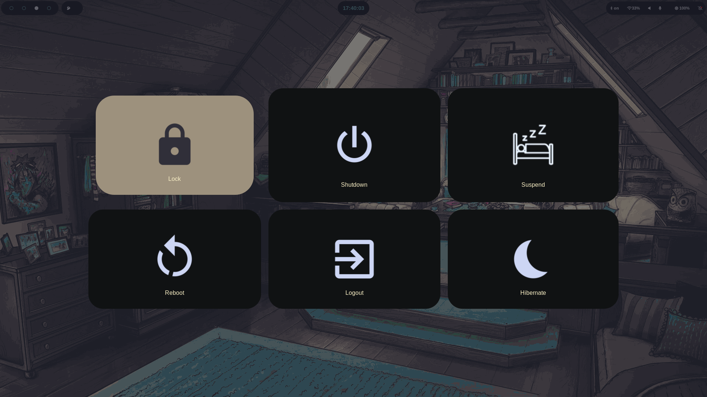

# looks 
|                      |                      |
|----------------------|----------------------|
|  |  |
|  |  |
|  |  |
|  |  |

# Dependencies 
nautilus
waybar
swappy
swaync
wlogout
hyprlock 
hyprland
kitty
network manager
pywal
yad
slurp
tmux
grimblast
rofi(wayland)
rofi-games 

#### hopefully i have covered them all, 
##### if you install these basic dots just tell me if some dependencies i forgot to add 

# dots installation 
chezmoi init https://github.com/harshborana11/configs.git
